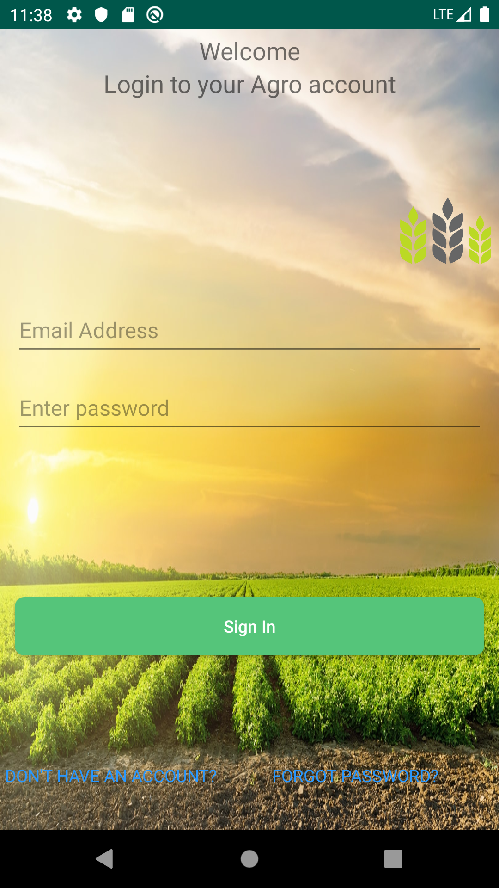
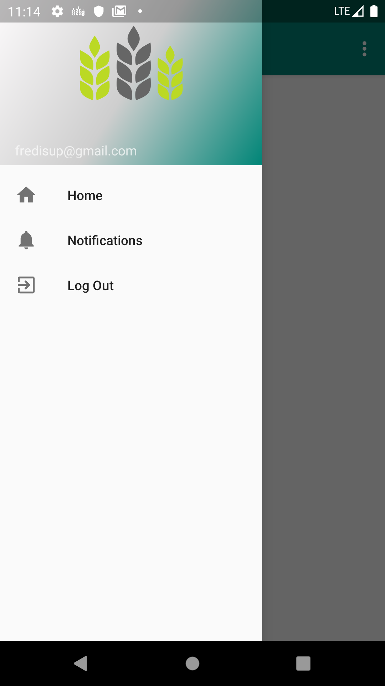
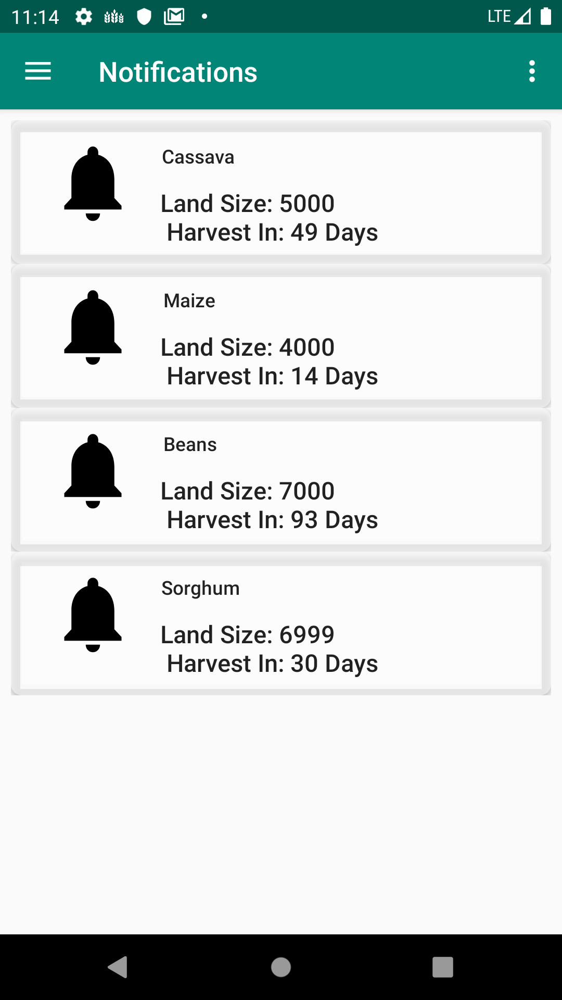
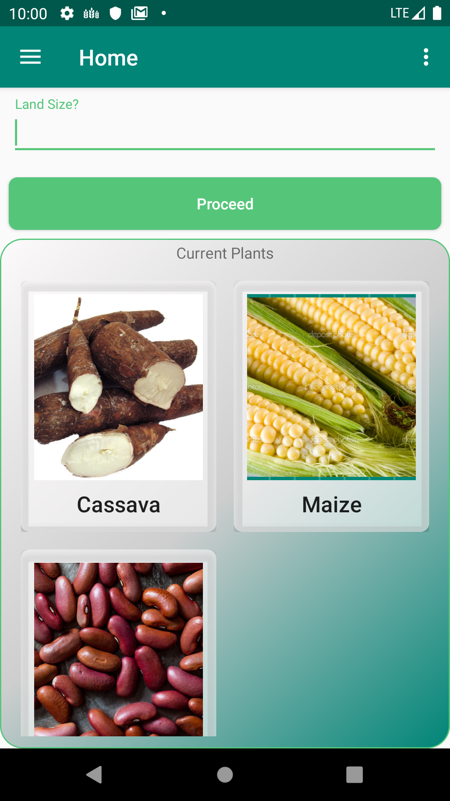
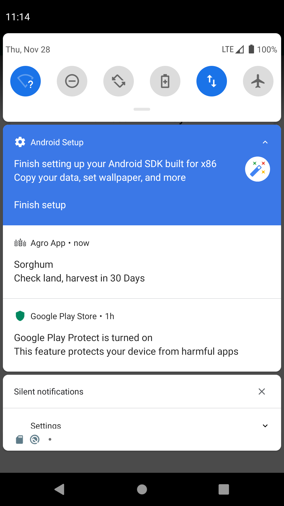

# Agroapp
Mobile App that facilitate farmer in thier dailly activities 

#Team
KU team kenya 
Innocent Kusinze IEEE member innocentumugu@gmail.com
Fidel Makatia IEEE member fidelmakatia01@gmail.com
Adam non IEEE member 

#Installation Guide

1 copy the apk file in the android phone and Install it 
2 you can download the complete project from github and build it to run on your phone or emulator 

#Account for testing 

email: fredisup@gmail.com
Password: muguma12

#Promotional Video

A video Demo link of the app : https://youtu.be/zAkIcmshlTw

#Description

This is a mobile application that gives farmers advice on the kind of crop to grow based on thier geographical location and the amount of seed to sow based on land size and terrain. it also gives notifications concerning time to weed, time to harvest ypes, of crop pests associated and drugs to buy and also has a culculator to calculate the amount of harvest expected given amount seeded. this is so as to ensure food security and cub poverty. The app also gives up dates on current farming technologies based on the type of farmer 

#Screenshots 

 

 
